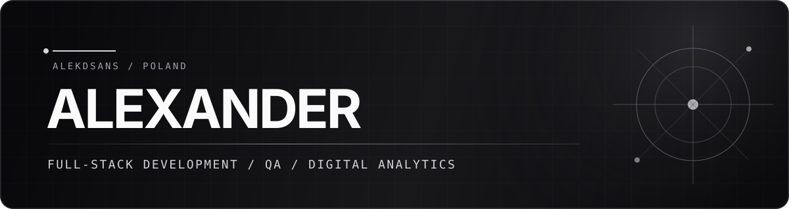

<div align="center">

# Alexander

### Full-Stack Developer · QA-Minded Builder · Digital Analytics

I build web products from the interface to the API and data layer, with particular attention to usability, testing, and measurable user journeys.

Poland · React · TypeScript · Node.js · Python

</div>

---

## Profile

My work sits at the intersection of product engineering and quality. I enjoy turning an idea into a polished interface, connecting it to reliable backend services, and making the result observable through useful analytics.

```text
design the interface  /  trace the data  /  test the edge cases
```

## Selected Work

| Project | Overview | Built with |
| :--- | :--- | :--- |
| [Avelis](https://github.com/AlekdSANS/avelis) | A full-stack fragrance storefront with a modern product experience, authenticated administration, media handling, orders, and tested API workflows. | React, TypeScript, Express, Prisma, PostgreSQL |
| [Conversion Tracking](https://github.com/AlekdSANS/conversion-tracking) | A practical analytics playground covering consent-aware events, GTM and GA4, campaign links, forms, authentication, and serverless email flows. | React, Node.js, MongoDB, GTM, GA4 |
| [Project ARO](https://github.com/AlekdSANS/ARO) | An interactive desktop-style experience created for ARG storytelling, with draggable windows, applications, hidden files, and puzzle-like interactions. | JavaScript, jQuery, SCSS, HTML |
| [Man & Van](https://github.com/AlekdSANS/ManAndVan) | A multilingual service website for a transport business, presenting services, vehicle details, coverage, contact paths, and an interactive map. | HTML, CSS, JavaScript, Leaflet |

## Toolkit

<p>
  
  
  
  
  
</p>

<p>
  
  
  
  
  
  
</p>

<p>
  
  
  
  
  
  
</p>

## Current Direction

- Building complete web applications with dependable authentication, data, and deployment flows.
- Designing privacy-aware analytics and conversion tracking that teams can actually verify.
- Developing stronger Python, algorithms, and data-engineering foundations.
- Contributing as a second developer and QA tester alongside [karawaqqe](https://github.com/karawaqqe).

---

<div align="center">

[Repositories](https://github.com/AlekdSANS?tab=repositories) · [Avelis](https://github.com/AlekdSANS/avelis) · [Conversion Tracking](https://github.com/AlekdSANS/conversion-tracking)

</div>
